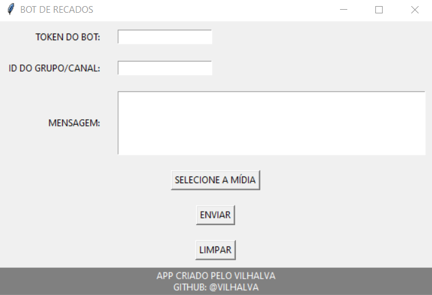

# BOT DE RECADOS

  

## DESCRIÇÃO:
Esse é um aplicativo desenvolvido em Python utilizando a biblioteca gráfica Tkinter e a biblioteca de bot do Telegram, chamada Telebot. Este bot oferece uma interface gráfica simples e intuitiva para os usuários enviarem mensagens ou mídias para grupos ou canais no Telegram de forma rápida e eficiente.

## RECURSOS:
1. **Envio de Mensagens:**
   - O bot permite que os usuários ingressem o token do bot, o ID do grupo/canal de destino e a mensagem que desejam enviar.
   - O campo de mensagem é um widget de texto que permite a inserção de mensagens mais longas e formatadas.

2. **Envio de Mídias:**
   - Os usuários podem enviar mídias, como imagens ou vídeos, selecionando o arquivo desejado por meio de um botão de seleção de mídia.
   - Se uma mensagem de texto for inserida junto com uma mídia, a mensagem será usada como legenda para a mídia.

3. **Persistência de Configurações:**
   - O bot salva automaticamente o token do bot e o ID do grupo/canal em um arquivo de configuração (settings.json).
   - Ao reiniciar o bot, as informações salvas são carregadas nos campos correspondentes, proporcionando uma experiência contínua para o usuário.

4. **Feedback Visual:**
   - O bot fornece feedback visual por meio de caixas de mensagem informativas e de alerta.
   - Mensagens de sucesso, erros ou avisos são exibidas em caixas de diálogo pop-up.

5. **Facilidade de Uso:**
   - A interface gráfica foi projetada de forma simples e organizada, facilitando a compreensão e utilização por usuários de diferentes níveis de experiência.

## COMO USAR?:
1. **Token do Bot:** Insira o token do seu bot do Telegram no campo correspondente. O qual pode ser obtido por meio do [@BotFather](https://t.me/BotFather).
2. **ID do Grupo/Canal:** Insira o ID do grupo ou canal de destino para onde deseja enviar a mensagem ou mídia. Se você não sabe qual é o `ID`, [CLIQUE AQUI](https://github.com/VILHALVA/BUSCADOR-DE-ID) para usar o nosso outro bot.
3. **Mensagem:** Digite a mensagem desejada ou deixe em branco se estiver enviando apenas mídia.
4. **Selecionar Mídia:** Clique no botão "Selecionar Mídia" para escolher um arquivo de imagem ou vídeo.
5. **Enviar:** Clique no botão "ENVIAR" para enviar a mensagem ou mídia para o grupo/canal selecionado.
6. **Limpar:** Use o botão "LIMPAR" para limpar todos os campos e iniciar uma nova mensagem.

Esse bot oferece uma maneira eficaz e amigável de interagir com o Telegram por meio de uma interface gráfica, tornando o envio de mensagens e mídias mais acessível e conveniente para os usuários.
